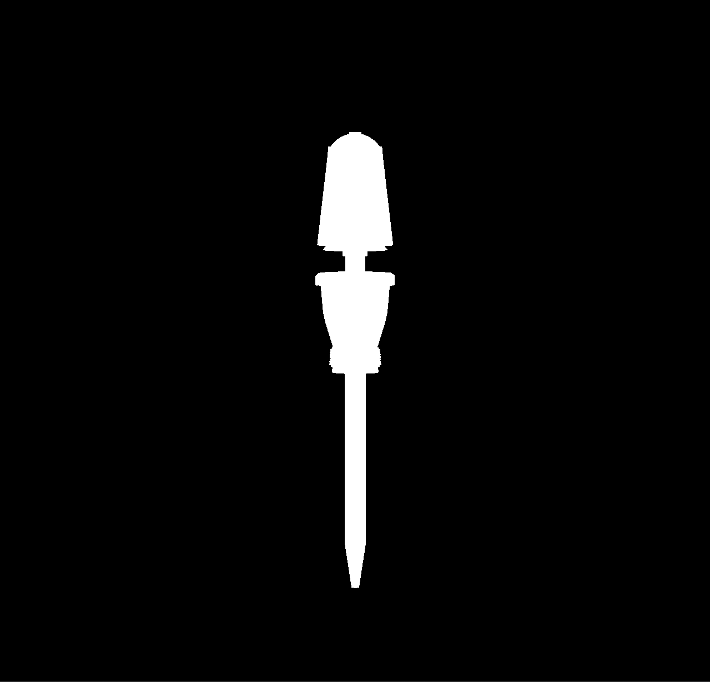
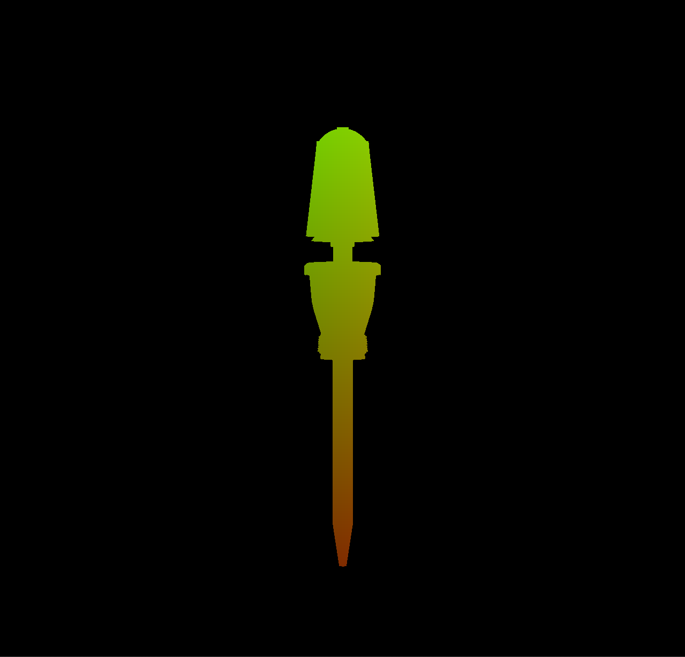
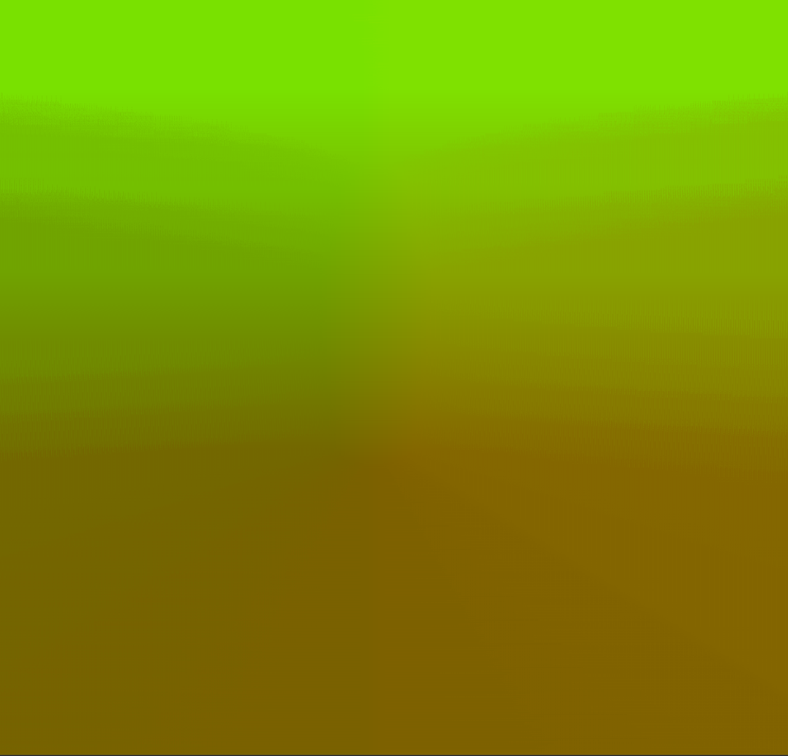

# Explanation for Distance Field PostProcessor

This implementation is based on the following resources:

- (primary source) https://bgolus.medium.com/the-quest-for-very-wide-outlines-ba82ed442cd9
- https://itscai.us/blog/post/jfa/
- Jump Flood Algorithm (https://www.comp.nus.edu.sg/~tants/jfa/i3d06.pdf)
- https://www.youtube.com/watch?v=nKJgUsAU2d0
- it is the same process used for text here: https://steamcdn-a.akamaihd.net/apps/valve/2007/SIGGRAPH2007_AlphaTestedMagnification.pdf

My implementation was written to generate object outline effects.

The stages of the implementation in the DistanceFieldPostProcessor.cpp implementation are as follows:

## Stage 1

Create a "mask" of the object to be outlined (white silhouette on black background). This is the same as rendering the object with a basic white shader on a black backround.
This is a 3d to 2d conversion and outputs the result to a texture buffer for further processing in 2D.

## Stage 2

Process the mask result above to apply the 2D texture coordinates of every pixel that is white, (u, v) or (x, y) (where every individual coordinate u and v is in range [0, 1]) to the RG (u -> Red, g -> Green) channel respectively. 

## Stage 3

The [JFA algorithm](https://www.comp.nus.edu.sg/~tants/jfa/i3d06.pdf) is now executed to create an unsigned distance field from the result in step 2. 
This runs the same shader multiple times based on the image width/height (with different "step sizes" every run) until the distance field "texture" is generated.

The output is interesting as for every pixel in the generated image, the RG (red, green) values of all the pixels at index (x,y) store the coordinates (in range [0, 1]) of the white pixel (from step 1) closest to the pixel at index (x, y). This fact can therefore be used to compute the distance between this pixel at index (x, y) and its closest white pixel -> giving you a distance field.

My implementation does not allow for negative distance fields because I have no need of them. The white pixels of the original mask image (step 1) retain the same values they got in (step 2), making the distance == 0 in their case.

(Note the particular image used is not completely accurate/correct for the image of step 2, but it will look quite similar visually nonetheless -- I'm too lazy to get a nicer example. See [this blog post](https://bgolus.medium.com/the-quest-for-very-wide-outlines-ba82ed442cd9) or [this one](https://itscai.us/blog/post/jfa/) for a correct rendering.)

## Stage 4

The Unsigned Distance Field from the previous step can now be used to achieve interesting effects relating to outlines. In my case I am using it to generate a basic white outline of consistent width regardless of how far the object is from the viewer. This "texture" can be considered as a 2D overlay that will be applied "on top of" the normally generated 3D image, which will result in an outline appearing around the object.

This is different from the outline effect presented here: https://learnopengl.com/Advanced-OpenGL/Stencil-testing which does not produce outlines of consistent width (the width depends on the distance in 3D and does not look nice for specific objects because you are using a scaling operation to achieve the effect)

- This article provides an example of when the stencil-based solution in 3d will produce a weird outline (animated image at the top): http://www.geoffprewett.com/blog/software/opengl-outline/index.html
- This blog article explains why the JFA algorithm is a good and efficient solution that has an O(log n) runtime complexity compared to alternative fixed-width outline solutions: https://bgolus.medium.com/the-quest-for-very-wide-outlines-ba82ed442cd9
- The Distance Field solution by itself (JFA is simply to generate a Distance Field in my solution) has separate use cases, particularly for text, discussed here: https://steamcdn-a.akamaihd.net/apps/valve/2007/SIGGRAPH2007_AlphaTestedMagnification.pdf

Note that I believe JFA does not work as well on non (n = (non-power of two) = 2^m), (n x n) images, generating weird artifacts in specific cases. In my use case this is not very observable but a more proper fix could be made to render the distance-field in a power of 2 texture buffer and then cut off some sections before re-applying it to the screen, fixing the issue.

Performance could also be improved by rendering the distance-field texture in a smaller buffer (scale down the image), and after being generated, using linear interpolation to render the outline/effect.