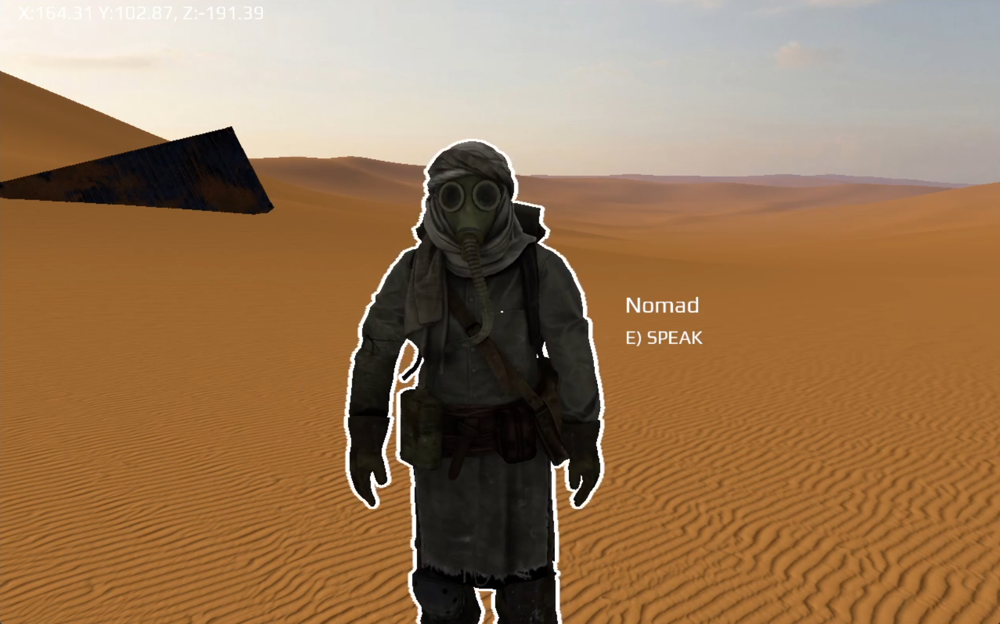

# Dune-Themed OpenGL/C++ Experiment 2024

Demo video [here](https://youtu.be/mQCm1eSfVaM?si=vDtXalnGGEmv6kYr)

## Background

Demo thing that I wrote, half for fun, half while finishing my part-time official CS degree (that I actually didn't have before I started working in SWE; in fact I ended up in big tech, at a mid level at time of writing, with _years of experience_ without a finished CS degree 😛. So I did "life things" entirely out of order due to random life circumstances, and yes I had to deal with many issues -- that I would describe in software terms as "lack of official support" -- due to this).

So you'll see random references relating to an "assignment" in the source code -- that's this degree thing. But this "assignment" was given at the very basic "introduction to CS"-"i only recently learned to program"-bachelor-student-level, so most of what I did with this was wayyy excessive and personal-interest related (particularly in the aesthetic presentation department). And I ended up focusing on design/visuals wayyy more than was expected for said assignment.

I thought the end-result looked neat, and I thought this might be a fun little opportunity to share something I did in a language (C++) that I otherwise haven't typically used as much in my last 6.5 years of professional work (I actually *did* use it at one of the companies I worked for, but there it was just the language of the "legacy" version of a backend server software that we were actively migrating away from and into C#).

The main reference I used while implementing this was [learnopengl.com](https://learnopengl.com/Introduction). This is a very useful site if you want to learn the background of how [OpenGL](https://en.wikipedia.org/wiki/OpenGL) (or [WebGL](https://developer.mozilla.org/en-US/docs/Web/API/WebGL_API) which I understand to just be a port of this to browsers) works!
- It's probably not ideal to start at this level of basics if you want to build a "serious" app ASAP, because you'll waste a bunch of time writing a bunch of utility things from scratch, when these utility classes have been done a million times over in libraries like [Three.js](https://threejs.org/manual/#en/creating-a-scene)
- I'd probably recommend people who want to learn to build arbitrary but relatively "lightweight" 3D things to look into something like [Three.js](https://threejs.org/manual/#en/creating-a-scene). You get the benefit that modern browsers are good enough these days to show off your work. And you can easily host your work in some cheap or free way like [Github pages](https://pages.github.com/), without requiring people to pull random C++ code and compile it for their system (now who wants to do that?) or without dealing with creating "release" executables. (This goes into more general "I'd like to build a random interactive 3D demo" thing, see for example [my repo here](https://github.com/parawanderer/personalsite2025))
- I'd probably recommend people who want to make video games to look into any of the currently popular video game engines ([Unity](https://en.wikipedia.org/wiki/Unity_(game_engine)) if you want something simple, [Unreal Engine](https://en.wikipedia.org/wiki/Unreal_Engine) if you want something that is performant and industry-standard, I'm sure there are alternatives that are more case-appropriate in specific use-cases)

## How to Build This

Note that I'm kind of writing this backwards in time after not having worked on this for a year. From memory:

### Prerequisites

- [Visual Studio 2022](https://visualstudio.microsoft.com/downloads/)
- Chances are this only works on Windows
- You need to [install the same libraries from the learnopengl.com intro](https://learnopengl.com/Getting-started/Creating-a-window). This was a very "manual" process. Package/dependency management in C++ at time of writing was just annoying like this.
- I recommend the [C++ ReShaper plugin by Jetbrains](https://www.jetbrains.com/resharper-cpp/). I feel it makes working with C++ feel more "smooth" like modern Java in IntelliJ, however I suppose this is simply a matter of taste.

### Building

Build it by opening the `OpenGLProj.sln` file in Visual Studio and using the "build" dropdown at the top left. Or run it from visual studio.

## References

As a mainly generalist SWE with a bit of an ancient background in graphics design/digital illustration, I never considered what types of algorithms and optimisations are relevant/useful when it comes to **3D rendering**.

So reading and implementing these papers & articles was interesting and insightful:

- ["Improved Alpha-Tested Magnification for Vector Textures and Special Effects" by Chris Green @ Valve](https://dl.acm.org/doi/10.1145/1281500.1281665)
- ["Jump Flooding in GPU with Applications to Voronoi Diagram and Distance Transform" by Guodong Rong and Tiow-Seng Tan](https://doi.org/10.1145/1111411.1111431)
    - See [this README](./OpenGLProj/resources/doc/distance_field_postprocessor/README.md) on how I implemented the pixel-perfect-ish "Outline" effect based on [this article by Ben Golus](https://bgolus.medium.com/the-quest-for-very-wide-outlines-ba82ed442cd9)

## Acknowledgements

Obviously the "theme" of this project are the new Dune movies (2021 & 2024), because I loved how they did the visuals for those.

Some of the assets I made myself (with my aforementioned background in design/art). A lot of assets were sourced from different authors via:

- [sketchfab.com](https://sketchfab.com/)
- [ambientcg.com](ambientcg.com)
- [freesound.org](https://freesound.org)
- [pixabay.com](https://pixabay.com/sound-effects)
- [elevenlabs.io](https://elevenlabs.io/)
- [mixamo.com](https://www.mixamo.com/)
- [toppng.com](https://toppng.com)

I tried to add some `.txt` files in a bunch of places to document where I got non-self-made assets.

This project was educational/made for educational purposes, so I used these 3rd party assets under that justification.

I've always found it so interesting that these kinds of 3D projects end up being such a large cross-domain collaboration effort. You can't get away with just being skilled at one or even a few things, you really need to work with others unless you want to spend a lot of time learning 20 different new skills.